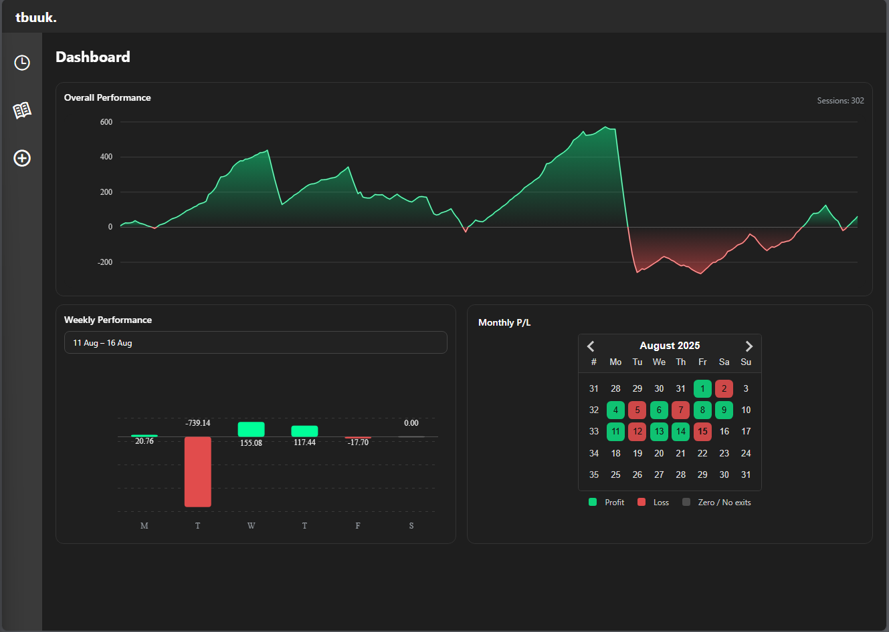
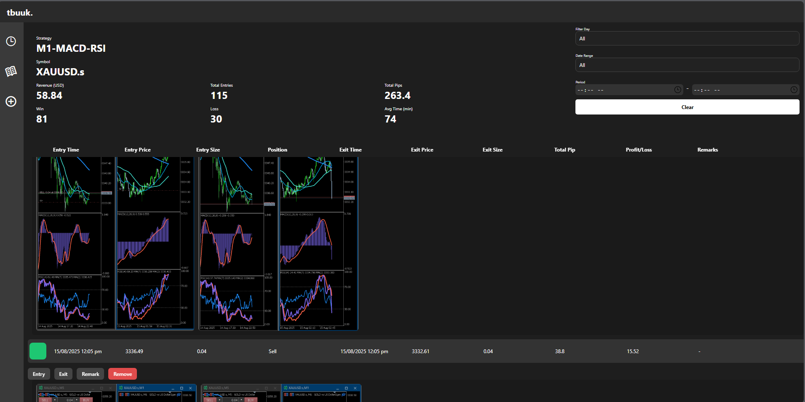
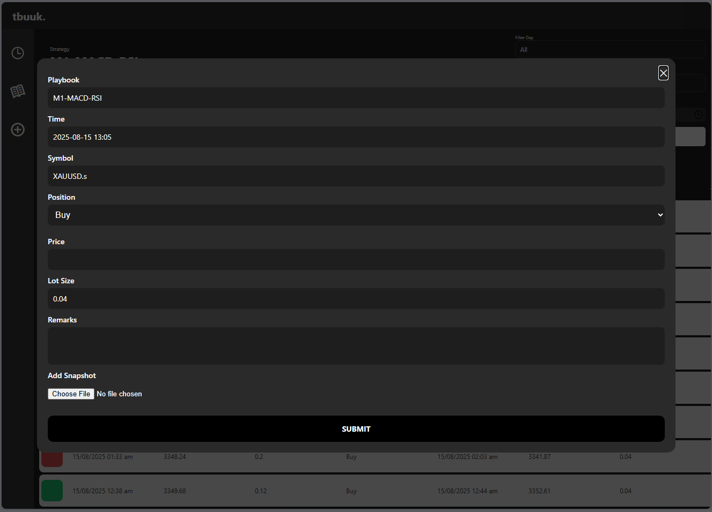

tbuuk — Trading Journal

A minimalist trading journal dashboard built with React Native (Expo) and react-native-chart-kit.
It visualizes your performance with a cumulative equity curve, a color-coded weekly P/L bar chart, and a monthly calendar heatmap.

I specifically developed this web application for myself because of few reasons.
First, existing application out there does not support the broker I am using now. Second, most trading journal out there require additional monthly cost and most of it do not suit my trading style.

Tbuuk was developed based on layering trading style. When a certain setup triggered, user able to keep on adding more buy/sell layer which still within the same setup. That is how I trade. From this apps, I able to monitor how many setup give me profit and loss. I can also filter out the historical data to analyse when is the best period of time or day for my setup. With this application, I able to review back all my bad entries and learn from my mistakes based on all screenshots saved. 

This application was initially developed using React Native Expo. I had to perform a lot of adjustment so that I could publish this on GitHub. It was also originally develop to use mySQL on my local device. So I tweaked a little bit for this project I published on GitHub with some dummy data.

I developed this using ChatGPT. Initially I tried by pasting screenshots of my UI which I designed on Figma. However, I was not satisfy with the results. So, I end up write the code for the UI then I will ask ChatGPT on how to add certain component and functions. I didnt use where ChatGPT just write the whole code because most of the time it will change things that I didnt ask them to. I was just ask for certain components, review it only then I post it into my code. It was a quite interesting journey developing this application.

Tech Stack
App: React Native (Expo), React Native Web
Charts: react-native-chart-kit (requires v6.14.0+)
SVG: react-native-svg
Calendar: react-datepicker (web)
State/Utilities: React hooks
Data: Mock API for GitHub version / mySQL for my local desktop version

Future improvement:
User able to assign each trade to a specfic playbook that user creates.
User able to specify symbol/instrument/currency that they are trading on each trade.
More overall analysis on the Dashboard page.
Customize analysis on their historical data.

